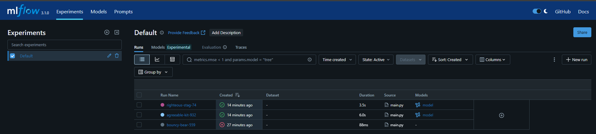

# 🔐 Network Security Threat Detection using Machine Learning

This project aims to detect **malicious or phishing URLs** using supervised Machine Learning algorithms. It uses a **modular ML pipeline**, integrates **MongoDB Atlas** for data handling, and **MLflow** for experiment tracking and reproducibility.

---

## 🚀 Project Highlights

- ✅ **Modular Code Structure**: All functionalities (data ingestion, transformation, model training, evaluation, logging) are implemented using a clean, scalable modular architecture.
- 📦 **Pipeline-Based Workflow**: Each stage of the ML lifecycle is automated using pipelined execution.
- 📊 **MLflow Integration**: For tracking experiments, hyperparameters, metrics, models, and artifacts.
- 🗃️ **MongoDB Atlas**: Used to store and retrieve raw and processed datasets securely from the cloud.


## 🧠 Algorithms Used

The following classification algorithms from `scikit-learn` were trained and evaluated:

- Logistic Regression
- K-Nearest Neighbors (KNN)
- Decision Tree
- Random Forest
- Gradient Boosting Classifier
- AdaBoost Classifier

---

## 🗂️ Dataset Description

The dataset includes various **URL and webpage-based features** used to detect if a link is **legitimate or a threat**.

### 🔑 Columns:

- `_id`, `having_IP_Address`, `URL_Length`, `Shortining_Service`, `having_At_Symbol`, `double_slash_redirecting`, `Prefix_Suffix`, `having_Sub_Domain`, `SSLfinal_State`, `Domain_registeration_length`, `Favicon`, `port`, `HTTPS_token`, `Request_URL`, `URL_of_Anchor`, `Links_in_tags`, `SFH`, `Submitting_to_email`, `Abnormal_URL`, `Redirect`, `on_mouseover`, `RightClick`, `popUpWidnow`, `Iframe`, `age_of_domain`, `DNSRecord`, `web_traffic`, `Page_Rank`, `Google_Index`, `Links_pointing_to_page`, `Statistical_report`

### 🎯 Target Variable:

- `Result`: 
  - `1` - Legitimate
  - `-1` - Phishing
  - `0` - Suspicious

---

## 🛠️ Tech Stack

| Tool            | Purpose                                  |
|-----------------|-------------------------------------------|
| Python          | Core programming language                |
| Scikit-learn    | ML models and metrics                    |
| MLflow          | Experiment tracking and logging          |
| MongoDB Atlas   | Cloud-hosted NoSQL database              |
| Pandas & NumPy  | Data manipulation and preprocessing      |

---

## 🧪 ML Pipeline Components

1. **Data Ingestion**: Pulls the data from MongoDB Atlas and stores it locally.
2. **Data Transformation**: Handles missing values, feature selection, and scaling.
3. **Model Training**: Trains multiple classifiers with hyperparameter tuning.
4. **Model Evaluation**: Evaluates models using metrics like accuracy, F1-score, R2 score, etc.
5. **Experiment Tracking**: Logs models, metrics, and artifacts using MLflow.

---

## 📊 Performance Metrics

Model performance was evaluated using:
- `Accuracy`
- `Precision / Recall / F1-Score`
- `R² Score` (for experimentation)
- `Confusion Matrix`
- MLflow artifacts for visual comparison

---

## 📁 Project Structure

```

networksecurity/
│
├── components/
│   ├── data\_ingestion.py
│   ├── data\_transformation.py
│   ├── model\_trainer.py
│   └── model\_evaluation.py
│
├── pipeline/
│   └── training\_pipeline.py
│
├── utils/
│   └── common.py
│
├── config/
│   └── mongo\_config.yaml
│
├── artifacts/         # Stores models, transformers, logs
├── mlruns/            # MLflow tracking directory
├── main.py            # Entry point
└── requirements.txt

````

---

## 🧪 How to Run the Project

1. **Install dependencies**  
```bash
pip install -r requirements.txt
````

2. **Configure MongoDB Atlas**
   Update your credentials in `mongo_config.yaml`.

3. **Launch MLflow UI**

```bash
mlflow ui
```

4. **Run the training pipeline**

```bash
python main.py
```

---

## 📈 Example MLflow Run Screenshot

 

---

## 🧩 Future Enhancements

* Hyperparameter tuning using `GridSearchCV` or `Optuna`
* Integration with `Streamlit` or `FastAPI` for real-time phishing detection
* Deployment to cloud with CI/CD support

---

## 📚 References

* [Scikit-learn Documentation](https://scikit-learn.org/)
* [MLflow Docs](https://mlflow.org/)
* [MongoDB Atlas](https://www.mongodb.com/cloud/atlas)

---

## 📬 Contact

For any queries or suggestions, feel free to connect via [LinkedIn](https://www.linkedin.com/in/mukesh05011996/).

---

```

